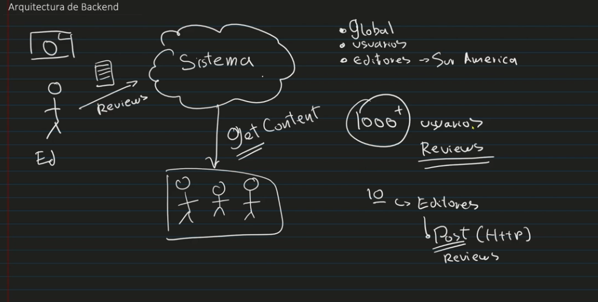

# CameraReviews System

## Overview: 
The company "RandomCameraReviews" needs a system that allows professional photographers to upload "reviews" of cameras, so that anyone from anywhere in the world can search for the reviews and buy them through their portal.
The company has a specialized front-end development team that will create a portal for editors to upload the "reviews" and for users to view them. They have requested that you, as a Backend specialist, provide them with a system, including an API, that allows the following:

* Upload camera reviews
* Retrieve the content of the reviews to display it on the portal's web and mobile views.
* User management for editors (excluding visitors who read the reviews)

It is also known that the company "RandomCameraReviews" plans to distribute mainly in South America where their largest market is, but they also have sales in North America, Europe, and very few in Asia.

### Scope

#### Use cases
* As an editor I would like to post a review for a camera.
* As an editor I would like to post a review for a camera lens.
* As an editor I should be able to check the reviews for the items.
* As an unregister user I should be able to check the reviews for the items.
* Every user should be able to buy the products through their portal.
* As a user I would like to see the reviews in a computer o a mobile device.
* As a admin I would like to create editors.
* As a admin I would like to update editors.
* As a admin I would like to delete editors.
* As a admin I would like to see a list of editors.

#### Out of Scope
* As an unregistered user, I would like to be able to post a review for a camera.
* As an admin I would like to manage customer users.
---
## Architecture

### Diagrams

* First Approach:

* Second Approach:

* Third Approach:

### Modelo de datos
Poner diseño de entidades, Jsons, tablas, diagramas entidad relación, etc..

---
## Limitations
List of known limitations. It can be in list form.
* The API call that allows to upload a review doesn't exceed the limits of latency 500ms.
* The API call that allows to get the reviews for reading must have a latency lower to 100ms.
---
## Cost
Cost Description/Analysis
"Considerando N usuarios diarios, M llamadas a X servicio/baseDatos/etc"
* 1000 llamadas diarias a serverless functions. $XX.XX
* 1000 read/write units diarias a X Database on-demand. $XX.XX
Total: $xx.xx (al mes/dia/año)